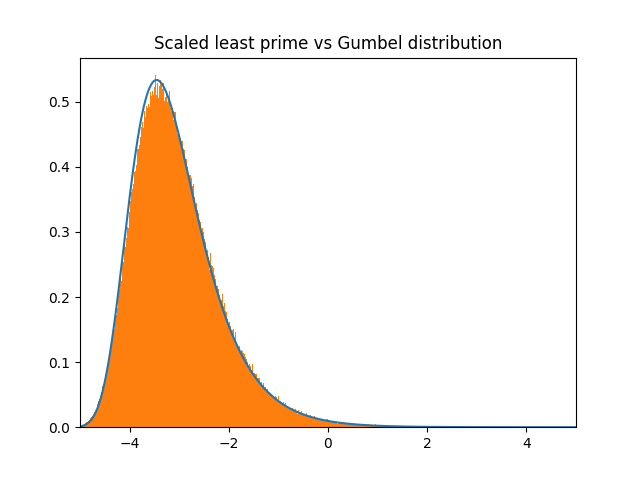

This contains code that accompanies [this paper.](https://arxiv.org/abs/1607.02543). 

The Makefile produces an executable program.exe (on windows), which can be run via

```
./program.exe 1000000
```

This executable then gives a records.txt file of the form

```
2:3
3:7
4:5
5:19
6:7
7:29
8:17
9:19
10:19
11:43
12:13
13:103
14:29
.
.
.
k:P(k)
```

where $k$ is the modulus and $P(k)$ is defined in the above paper as the max over $(a,k) = 1$ of the least prime equivalent to $a$ modulo $k$. Then produce_plot.py takes in that txt file and produces Figure 2 from the above paper. 


